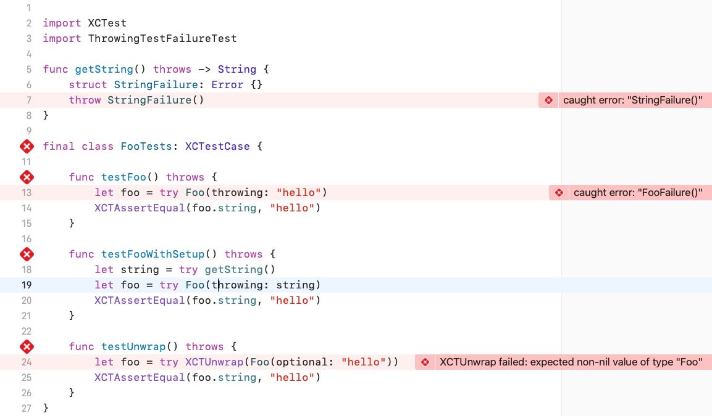

# ThrowingTestFailureTest

The following screenshot is of Xcode 11.4 and shows that the test failure is shown on the line that caused it, unless it was another function inside the test module in which case the failure is shown inside that function instead. 

